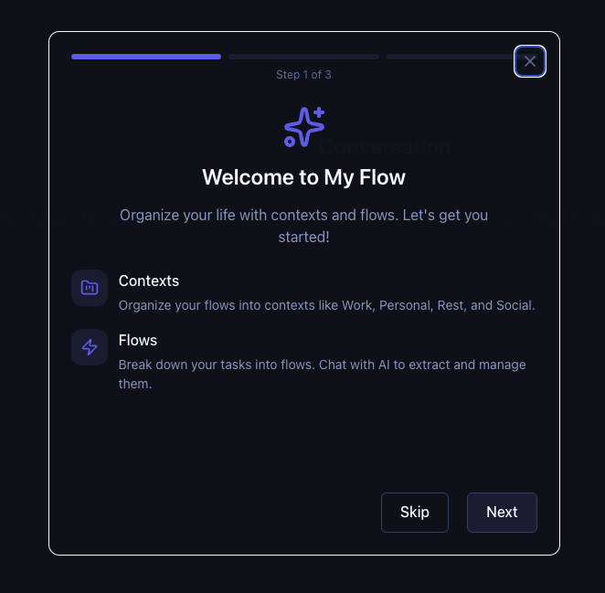
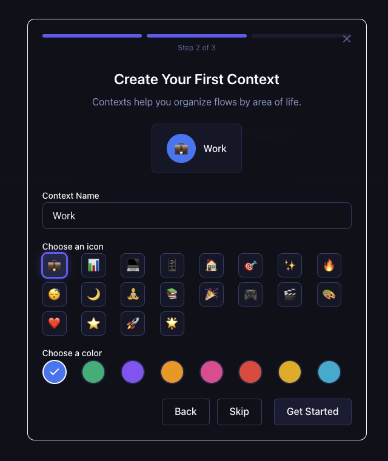
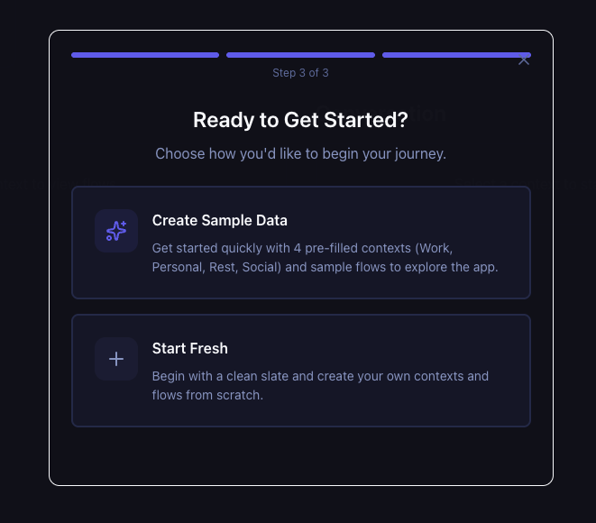
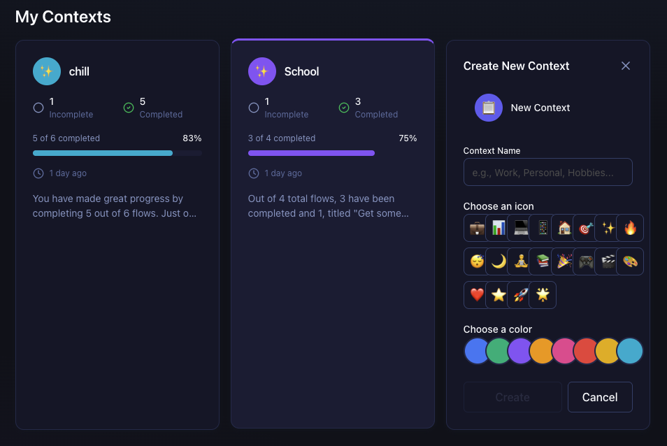
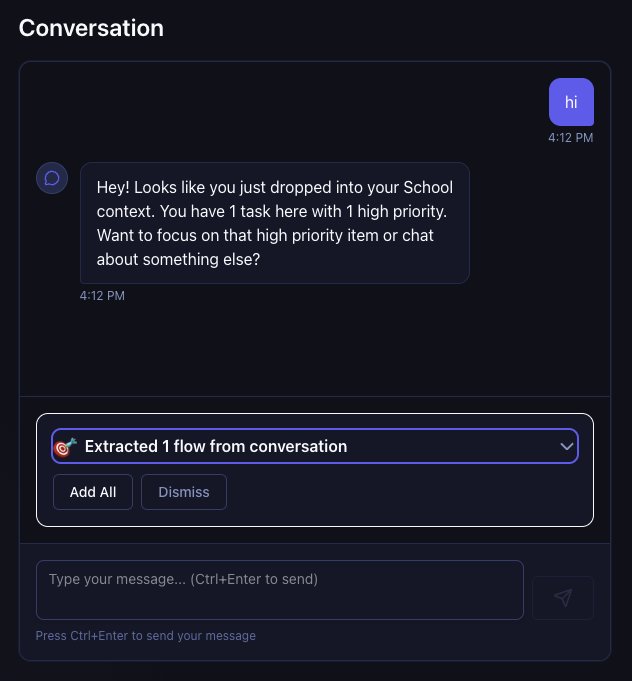
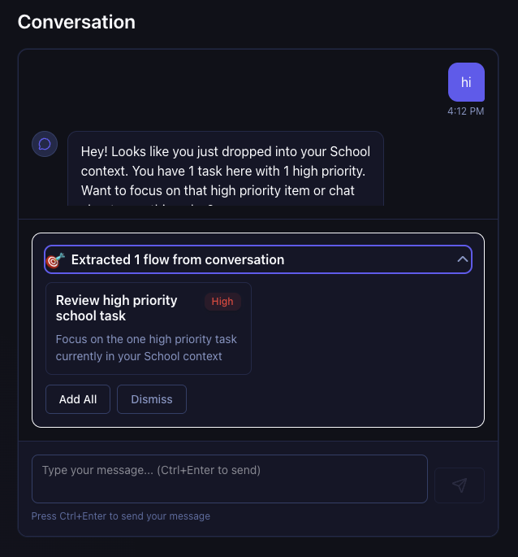
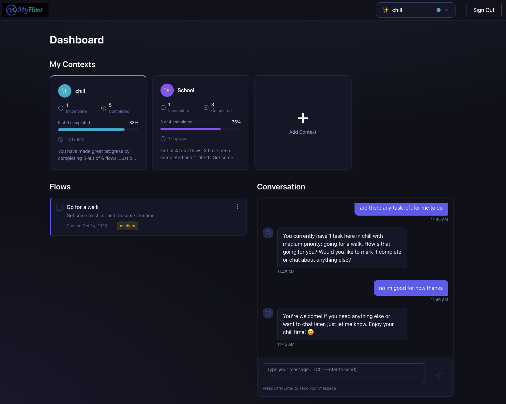

# MyFlow - Context-Aware Flow Management System

A production-ready **fullstack monorepo** built with **Next.js 15**, **React 19 Server Components**, **FastAPI**, and **MongoDB**. Features an **intelligent AI conversational agent** for natural language task management with automatic flow extraction, context-aware conversations, and AI-powered task operations.

[](https://github.com/mario-digital/my_flow_app/actions/workflows/ci.yml)
[](https://github.com/mario-digital/my_flow_app/actions/workflows/codeql.yml)
[](https://github.com/mario-digital/my_flow_app)
[](https://www.typescriptlang.org/)
[](https://www.python.org/)
[](https://github.com/astral-sh/ruff)

---

## 📖 Table of Contents

- [Executive Summary](#executive-summary)
- [Screenshots & Demo](#screenshots--demo)
- [AI Agent Features](#ai-agent-features)
- [Architecture Overview](#architecture-overview)
- [Quick Start](#quick-start)
- [Monorepo Structure](#monorepo-structure)
- [Detailed Documentation](#detailed-documentation)
- [CI/CD & Quality Automation](#cicd--quality-automation)

---

## Executive Summary

- **AI-Powered Flow Management:** Streaming conversational agent with automatic task extraction and function calling; configurable AI providers.
- **Server-First Architecture:** React 19 Server Components default; Client Components only when necessary (90% bundle reduction).
- **Backend-for-Frontend (BFF):** JWT tokens **never** exposed to browser; Next.js API routes proxy all backend requests.
- **Security by Design:** Logto OAuth 2.0 + JWT validation with JWKS caching; HttpOnly cookies; no tokens in browser.
- **Type Safety:** End-to-end type safety with TypeScript strict mode (frontend) + Python type hints with mypy (backend).
- **Clean Architecture:** Backend follows layered architecture (Routers → Services → Repositories → DB).
- **Design System:** Three-layer CSS token architecture (primitives → semantic → component) enables runtime context theming.
- **Monorepo Efficiency:** Bun workspaces with unified scripts; single `bun run dev` starts both servers.
- **Quality Gates:** 80%+ test coverage enforced; Husky pre-commit hooks (ESLint + Ruff); pytest + Vitest.

---

## Screenshots & Demo

Experience the complete MyFlow journey from onboarding to AI-powered task management:

### Onboarding Experience

<div align="center">
  
  <p><em>Step 1: Introduction to Contexts and Flows concept</em></p>
</div>

<div align="center">
  
  <p><em>Step 2: Interactive context creation with icon and color customization</em></p>
</div>

<div align="center">
  
  <p><em>Step 3: Choose between sample data or start fresh</em></p>
</div>

### Context Management

<div align="center">
  
  <p><em>Context overview with progress tracking and create new context modal</em></p>
</div>

<div align="center">
  
  <p><em>Smart context switching with progress indicators</em></p>
</div>

### AI-Powered Conversation

<div align="center">
  
  <p><em>Real-time AI conversation with automatic flow extraction notification</em></p>
</div>

### Main Dashboard

<div align="center">
  
  <p><em>Complete dashboard: Context switcher, flow list, and AI conversation panel</em></p>
</div>

---

**Key Features Visible:**
- 🎨 Customizable contexts with icons and colors
- 📊 Real-time progress tracking
- 🤖 AI-powered flow extraction from natural language
- 💬 Streaming conversational interface
- ✅ Task completion and priority management
- 🎯 Context-aware organization

---

## AI Agent Features

MyFlow includes an **intelligent AI conversational agent** that makes task management natural and effortless:

### What It Does

1. **Streaming Conversations**
   - Real-time chat with token-by-token responses (OpenAI GPT-4 or Anthropic Claude 3.5 Sonnet)
   - Context-aware responses tailored to your current context
   - All conversations automatically saved and retrievable

2. **Automatic Flow Extraction**
   - AI analyzes your natural language and creates actionable tasks automatically
   - Example: _"I need to finish the presentation and call the client"_ → Creates 2 flows instantly
   - No manual task creation needed

3. **AI Function Calling**
   - _"Mark presentation as done"_ → AI completes the task
   - _"Delete the client call task"_ → AI removes the task
   - _"Make the report high priority"_ → AI adjusts priority
   - Real-time visual feedback for all actions

4. **Context Transition Intelligence**
   - Smart warnings when switching contexts with incomplete tasks
   - Suggests urgent tasks in the target context
   - Helps maintain focus and avoid forgetting important items

### How It Works

- **Frontend:** React Server Components + Client Components for chat UI, SSE streaming, BFF proxy for security
- **Backend:** FastAPI with configurable AI providers (OpenAI/Anthropic), streaming responses, flow extraction, function calling registry
- **Security:** All API keys secured via 1Password CLI, JWT tokens never exposed to browser, user-specific operations with authorization checks

**For detailed implementation:** See [Backend README - AI Services](my_flow_api/README.md#ai-services) and [Frontend README - Architecture](my_flow_client/README.md#architecture)

---

## Architecture Overview

### High-Level System Design

```
┌──────────────────────────────────────────────────────────┐
│                      BROWSER                              │
│  • No JWT tokens (HttpOnly cookies only)                 │
│  • React 19 Server Components (90% server-rendered)      │
│  • Client Components for interactivity only              │
└─────────────────────┬────────────────────────────────────┘
                      │ fetch('/api/flows')
┌─────────────────────▼────────────────────────────────────┐
│               NEXT.JS 15 (BFF Proxy)                     │
│  • Server Components: Direct data fetching               │
│  • API Routes: Proxy to FastAPI with JWT                 │
│  • Server Actions: Form mutations                        │
│  • getApiAccessToken() → JWT (server-side only)          │
└─────────────────────┬────────────────────────────────────┘
                      │ Authorization: Bearer {JWT}
┌─────────────────────▼────────────────────────────────────┐
│              FASTAPI BACKEND (Python)                    │
│  ┌────────────────────────────────────────────────────┐  │
│  │ Routers → Services → Repositories → MongoDB        │  │
│  └────────────────────────────────────────────────────┘  │
│  • JWT validation with JWKS caching                      │
│  • Clean Architecture layers                             │
│  • AI service integration (OpenAI/Anthropic)             │
└──────────────────────────────────────────────────────────┘
```

### Tech Stack

| Layer | Technology | Purpose |
|-------|-----------|---------|
| **Frontend** | Next.js 15 + React 19 | Server Components, App Router |
| **Styling** | Tailwind CSS + Design Tokens | 3-layer token system for theming |
| **State** | TanStack Query + React Context | Server state + minimal local state |
| **Backend** | FastAPI (Python 3.12+) | Async REST API, Clean Architecture |
| **Database** | MongoDB 7.x (Motor) | NoSQL document store |
| **Auth** | Logto (OAuth 2.0 + JWT) | Next.js + Python SDKs |
| **AI** | OpenAI / Anthropic | GPT-4 or Claude 3.5 Sonnet |
| **Testing** | Vitest + pytest + Playwright | 70/20/10 test pyramid |
| **Package Manager** | Bun 1.x | 10x faster than npm |

### Key Architectural Patterns

- **Backend-for-Frontend (BFF):** Next.js API routes proxy all backend calls with JWT tokens server-side only
- **Server-First Rendering:** 90% React Server Components, 10% Client Components
- **Clean Architecture:** Backend layers (Routers → Services → Repositories)
- **Design Tokens:** 3-layer CSS system (primitives → semantic → component)
- **Optimistic Updates:** TanStack Query for instant UI feedback with automatic rollback

**For detailed architecture:** See [Frontend README](my_flow_client/README.md) • [Backend README](my_flow_api/README.md) • [Architecture Docs](docs/architecture/)

---

## Quick Start

### Prerequisites

- **Bun 1.x** (frontend package manager)
- **Python 3.12+** with **uv** (backend package manager)
- **MongoDB Atlas** account (free tier)
- **Logto** account (authentication)
- **OpenAI or Anthropic API key** (AI features)
- **1Password CLI** (`op`) for secret management

### Installation

```bash
# Clone the repository
git clone https://github.com/mario-digital/my_flow_app.git
cd my_flow_app

# Install dependencies (both frontend and backend)
bun install
cd my_flow_api && uv sync && cd ..
```

### Configuration

1. **Copy environment template:**
   ```bash
   cp .env.template .env.local
   ```

2. **Set up 1Password CLI:**
   - Install: `brew install --cask 1password-cli`
   - Sign in: `op signin`
   - Store secrets in vault (MongoDB URI, Logto credentials, AI keys)

3. **Configure services:**
   - **MongoDB Atlas:** Create free cluster, get connection string
   - **Logto:** Create app, configure redirect URIs
   - **OpenAI/Anthropic:** Get API key

**Detailed setup instructions:**
- [Frontend Setup](my_flow_client/README.md#setup)
- [Backend Setup](my_flow_api/README.md#setup)

### Running the App

```bash
# Start both frontend and backend (from root)
bun run dev
```

This starts:
- **Frontend:** http://localhost:3000 (Next.js)
- **Backend:** http://localhost:8000 (FastAPI)
- **API Docs:** http://localhost:8000/api/v1/docs (Swagger UI)

### Testing

```bash
# Run all tests (frontend + backend)
bun run test

# Frontend tests only
cd my_flow_client && bun test

# Backend tests only
cd my_flow_api && uv run pytest
```

---

## Monorepo Structure

```
my_flow_app/
├── my_flow_client/              # Next.js 15 frontend (Bun workspace)
│   ├── src/
│   │   ├── app/                 # Next.js App Router (pages + API routes)
│   │   ├── components/          # React components (Server + Client)
│   │   ├── hooks/               # React hooks (TanStack Query)
│   │   ├── lib/                 # Utilities, API client, auth
│   │   └── types/               # TypeScript types
│   ├── public/                  # Static assets
│   ├── __tests__/               # Integration tests
│   ├── e2e/                     # Playwright E2E tests
│   └── README.md                # 📖 Detailed frontend documentation
│
├── my_flow_api/                 # FastAPI backend (Python uv project)
│   ├── src/
│   │   ├── routers/             # HTTP endpoints
│   │   ├── services/            # Business logic + AI services
│   │   ├── repositories/        # Data access layer
│   │   ├── models/              # Pydantic models
│   │   ├── middleware/          # Auth, CORS, etc.
│   │   ├── main.py              # FastAPI app
│   │   └── config.py            # Configuration
│   ├── tests/                   # pytest tests
│   └── README.md                # 📖 Detailed backend documentation
│
├── docs/                        # 📚 Comprehensive documentation
│   ├── architecture/            # Architecture documents (sharded)
│   │   ├── index.md             # Architecture overview
│   │   ├── tech-stack.md        # Technology decisions
│   │   ├── frontend-architecture.md
│   │   ├── backend-architecture.md
│   │   ├── api-specification.md
│   │   └── ... (more docs)
│   └── ux-design-tokens/        # Design system documentation
│
├── .github/                     # CI/CD workflows
│   ├── workflows/               # GitHub Actions
│   │   ├── ci.yml               # Full stack CI
│   │   ├── codeql.yml           # Security scanning
│   │   └── auto-label.yml       # PR auto-labeling
│   ├── ISSUE_TEMPLATE/          # Issue templates
│   └── pull_request_template.md # PR template
│
├── .husky/                      # Git hooks
│   ├── pre-commit               # Lint-staged, format, lint
│   └── pre-push                 # Full tests, coverage, build
│
├── .env.template                # Environment variables (1Password refs)
├── CONTRIBUTING.md              # Contributing guide
├── package.json                 # Root workspace config
└── README.md                    # 👈 You are here
```

**Workspace Management:**
- **Root `package.json`:** Defines workspaces and unified scripts
- **Bun workspaces:** Shared dependencies, single lockfile
- **Unified commands:** `bun run dev`, `bun run test`, `bun run lint`

---

## Detailed Documentation

### 📖 Deep Dive Documentation

- **[Frontend README](my_flow_client/README.md)**
  - Next.js 15 + React 19 architecture
  - BFF authentication pattern
  - CSS Design Tokens system
  - State management (TanStack Query)
  - Component structure
  - Testing strategy

- **[Backend README](my_flow_api/README.md)**
  - FastAPI Clean Architecture
  - Logto JWT authentication
  - AI Services implementation
  - API endpoint documentation
  - Database schema & indexes
  - Testing strategy

- **[Architecture Documentation](docs/architecture/)**
  - Comprehensive technical specs
  - API specifications (OpenAPI)
  - Data models
  - Folder structure guidelines
  - Security architecture

- **[Contributing Guide](CONTRIBUTING.md)**
  - Development workflow
  - Code standards
  - Testing requirements
  - PR process

---

## CI/CD & Quality Automation

**Status:** ✅ **Production-ready quality gates and automation**

### 🔒 Local Quality Gates (Git Hooks)

**Pre-Commit Hook** - Runs on every commit:
- ✨ `lint-staged` - Auto-formats changed files
- 🧹 ESLint (frontend) + Ruff (backend) - Lints only changed files
- 📝 TypeScript + mypy type checking
- ⚡ Smart detection - Only checks relevant code (frontend/backend)

**Pre-Push Hook** - Runs before push:
- 🧪 Full test suite with coverage (80%+ required)
- 🏗️ Production build verification
- 🔒 Secret detection (prevents committing `.env` files)
- 🔍 Full linting and type checking
- ⚡ Only runs checks for changed code paths

### 🤖 GitHub Actions Workflows

**Full Stack CI** (`.github/workflows/ci.yml`)
- Triggers: Every push and PR to `main`
- Backend job: Ruff → mypy → pytest with coverage
- Frontend job: ESLint → tsc → Vitest with coverage → build
- Parallel execution for speed
- Dependency caching (2-3x faster)
- Coverage uploaded to Codecov
- Status check that fails if any job fails

**CodeQL Security Scanning** (`.github/workflows/codeql.yml`)
- Triggers: Every push, PR, and weekly (Mondays)
- Analyzes JavaScript/TypeScript and Python code
- Detects security vulnerabilities automatically
- Reports to GitHub Security tab
- Industry-standard security analysis

**Auto-Labeling** (`.github/workflows/auto-label.yml`)
- Triggers: Every PR opened/updated
- Automatically adds labels based on changed files:
  - `frontend`, `backend`, `documentation`, `tests`
  - `ci`, `dependencies`, `configuration`
- Makes PR organization effortless

**Dependabot** (`.github/dependabot.yml`)
- Schedule: Weekly (Mondays)
- Monitors frontend (npm), backend (pip), and GitHub Actions
- Creates PRs for dependency updates
- Max 10 PRs per ecosystem
- Auto-assigns reviewers
- Keeps dependencies secure and up-to-date

### 📊 Coverage & Quality Metrics

- **Frontend:** 80%+ line coverage (enforced)
- **Backend:** 80%+ line coverage (enforced)
- **E2E:** Critical user flows covered
- **Codecov:** Real-time coverage tracking
- **CodeQL:** Continuous security monitoring

### ✅ What's Fully Automated

- ✅ Code formatting (Prettier + Ruff)
- ✅ Linting (ESLint + Ruff)
- ✅ Type checking (TypeScript + mypy)
- ✅ Unit tests (Vitest + pytest)
- ✅ Integration tests (both frontend and backend)
- ✅ Build verification (Next.js production builds)
- ✅ Security scanning (CodeQL)
- ✅ Dependency updates (Dependabot)
- ✅ PR labeling (auto-labeler)
- ✅ Coverage tracking (Codecov)

### ⏳ Planned for Future

- 🔄 Frontend deployment to Vercel (automatic preview + production)
- 🔄 Backend deployment to Railway (container + auto-scaling)
- 🔄 MongoDB Atlas production integration
- 🔄 E2E tests in CI (Playwright on GitHub Actions)
- 🔄 Performance monitoring (Lighthouse CI)

### 🎯 Quality Gate Requirements

**For any code to be merged to `main`:**

1. ✅ All pre-commit checks pass (local)
2. ✅ All pre-push checks pass (local)
3. ✅ GitHub Actions CI passes (all jobs green)
4. ✅ No CodeQL security alerts introduced
5. ✅ Test coverage ≥ 80%
6. ✅ No TypeScript/mypy type errors
7. ✅ No linting errors
8. ✅ Production build succeeds

**Recommended (can be enforced via branch protection):**
- ✅ At least 1 code review approval
- ✅ Branch is up-to-date with `main`

### 🔗 Quick Links

- **CI Dashboard:** https://github.com/mario-digital/my_flow_app/actions
- **Security Alerts:** https://github.com/mario-digital/my_flow_app/security
- **Coverage Reports:** (Configure Codecov after first push)
- **Dependabot PRs:** Check Pull Requests with `dependencies` label

---

**Note:** This CI/CD setup represents enterprise-grade automation, ensuring nothing broken reaches production.

---

## Contributing

We welcome contributions! Please see our [Contributing Guide](CONTRIBUTING.md) for details on:

- Development workflow
- Code standards (TypeScript strict, Python type hints, ESLint, Ruff)
- Testing requirements (80%+ coverage)
- Pull request process
- Quality gates

### Key Development Commands

```bash
# Development
bun run dev              # Start both servers

# Testing
bun run test             # Run all tests
bun run test:frontend    # Frontend tests only
bun run test:backend     # Backend tests only

# Code Quality
bun run lint             # Lint all code
bun run format           # Format all code
bun run typecheck        # Type check all code
```

---

## License

This project is licensed under the MIT License - see the [LICENSE](LICENSE) file for details.

---

## Support

- **📖 Documentation:** [docs/architecture/](docs/architecture/)
- **🐛 Issues:** [GitHub Issues](https://github.com/mario-digital/my_flow_app/issues)
- **💬 Discussions:** [GitHub Discussions](https://github.com/mario-digital/my_flow_app/discussions)

---

**Built with ❤️ using Next.js 15, React 19, FastAPI, and MongoDB**
