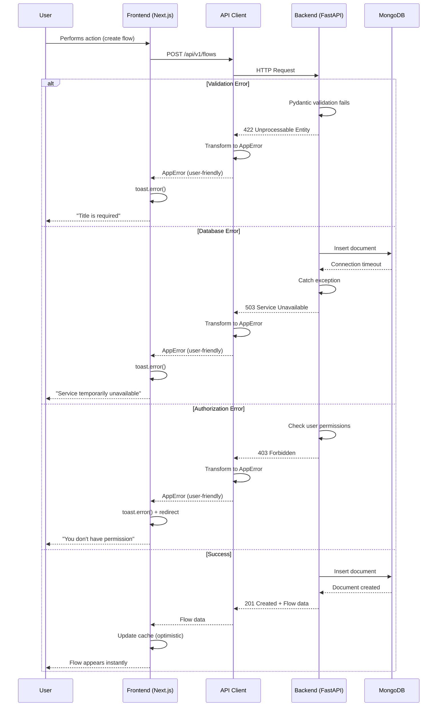

# 15. Error Handling Strategy

## Error Flow Diagram



## Error Response Format

**Unified API error response structure:**

```typescript
// src/types/errors.ts
interface ApiError {
  error: {
    code: string;           // Machine-readable error code (e.g., "VALIDATION_ERROR")
    message: string;        // User-friendly error message
    details?: Record<string, any>; // Additional context (e.g., field validation errors)
    timestamp: string;      // ISO 8601 timestamp
    requestId: string;      // Unique request ID for tracing
  };
}

// Example validation error response
{
  "error": {
    "code": "VALIDATION_ERROR",
    "message": "Title is required and cannot be empty",
    "details": {
      "field": "title",
      "constraint": "minLength",
      "value": ""
    },
    "timestamp": "2024-01-15T10:30:00Z",
    "requestId": "req_abc123"
  }
}

// Example authorization error response
{
  "error": {
    "code": "FORBIDDEN",
    "message": "You don't have permission to modify this flow",
    "details": {
      "resource": "flow",
      "resourceId": "flow_xyz789",
      "requiredPermission": "write"
    },
    "timestamp": "2024-01-15T10:31:00Z",
    "requestId": "req_def456"
  }
}
```

## Frontend Error Handling

**Centralized error transformation and display:**

```typescript
// src/lib/errors.ts
export class AppError extends Error {
  constructor(
    public code: string,
    public userMessage: string,
    public details?: Record<string, any>,
    public statusCode?: number
  ) {
    super(userMessage);
    this.name = 'AppError';
  }
}

export function transformError(error: unknown): AppError {
  // API error response
  if (error && typeof error === 'object' && 'error' in error) {
    const apiError = error as ApiError;
    return new AppError(
      apiError.error.code,
      apiError.error.message,
      apiError.error.details
    );
  }

  // Axios/Fetch error
  if (error && typeof error === 'object' && 'response' in error) {
    const httpError = error as { response: { status: number; data: any } };

    if (httpError.response.status === 401) {
      return new AppError(
        'UNAUTHORIZED',
        'Your session has expired. Please sign in again.',
        undefined,
        401
      );
    }

    if (httpError.response.status === 403) {
      return new AppError(
        'FORBIDDEN',
        "You don't have permission to perform this action.",
        undefined,
        403
      );
    }

    if (httpError.response.status === 404) {
      return new AppError(
        'NOT_FOUND',
        'The requested resource was not found.',
        undefined,
        404
      );
    }

    if (httpError.response.status >= 500) {
      return new AppError(
        'SERVER_ERROR',
        'Something went wrong on our end. Please try again later.',
        undefined,
        httpError.response.status
      );
    }
  }

  // Network error
  if (error && typeof error === 'object' && 'message' in error) {
    const msg = (error as Error).message;
    if (msg.includes('fetch') || msg.includes('network')) {
      return new AppError(
        'NETWORK_ERROR',
        'Unable to connect. Please check your internet connection.',
        { originalMessage: msg }
      );
    }
  }

  // Unknown error
  return new AppError(
    'UNKNOWN_ERROR',
    'An unexpected error occurred. Please try again.',
    { originalError: String(error) }
  );
}

// Error boundary for React components
export function handleMutationError(error: unknown) {
  const appError = transformError(error);

  // Display user-friendly message
  toast.error(appError.userMessage);

  // Log to monitoring service
  console.error('Mutation failed:', {
    code: appError.code,
    message: appError.userMessage,
    details: appError.details,
  });

  // Redirect to login if unauthorized
  if (appError.statusCode === 401) {
    window.location.href = '/login';
  }
}
```

**Usage in mutations:**

```typescript
// src/hooks/useCreateFlow.ts
export function useCreateFlow() {
  const queryClient = useQueryClient();

  return useMutation({
    mutationFn: (data: FlowCreate) => apiClient.post<Flow>('/api/v1/flows', data),

    onSuccess: (newFlow) => {
      queryClient.invalidateQueries({ queryKey: ['flows'] });
      toast.success('Flow created successfully');
    },

    onError: (error) => {
      handleMutationError(error); // Centralized error handling
    },
  });
}
```

## Backend Error Handling

**Unified error handling middleware and exception classes:**

```python
# src/exceptions.py
from fastapi import HTTPException, Request
from fastapi.responses import JSONResponse
from datetime import datetime
import uuid
from typing import Optional, Dict, Any

class AppException(Exception):
    """Base exception for all application errors"""
    def __init__(
        self,
        code: str,
        message: str,
        status_code: int = 500,
        details: Optional[Dict[str, Any]] = None
    ):
        self.code = code
        self.message = message
        self.status_code = status_code
        self.details = details or {}
        super().__init__(self.message)

class ValidationException(AppException):
    def __init__(self, message: str, field: str, value: Any):
        super().__init__(
            code="VALIDATION_ERROR",
            message=message,
            status_code=422,
            details={"field": field, "value": value}
        )

class ResourceNotFoundException(AppException):
    def __init__(self, resource: str, resource_id: str):
        super().__init__(
            code="NOT_FOUND",
            message=f"{resource.capitalize()} not found",
            status_code=404,
            details={"resource": resource, "resourceId": resource_id}
        )

class UnauthorizedException(AppException):
    def __init__(self, message: str = "Authentication required"):
        super().__init__(
            code="UNAUTHORIZED",
            message=message,
            status_code=401
        )

class ForbiddenException(AppException):
    def __init__(self, message: str, resource: str, resource_id: str):
        super().__init__(
            code="FORBIDDEN",
            message=message,
            status_code=403,
            details={"resource": resource, "resourceId": resource_id}
        )

# src/middleware/error_handler.py
from fastapi import Request, status
from fastapi.responses import JSONResponse
from fastapi.exceptions import RequestValidationError
from pydantic import ValidationError
import logging

logger = logging.getLogger(__name__)

async def app_exception_handler(request: Request, exc: AppException) -> JSONResponse:
    """Handle application-specific exceptions"""
    request_id = request.state.request_id if hasattr(request.state, 'request_id') else str(uuid.uuid4())

    error_response = {
        "error": {
            "code": exc.code,
            "message": exc.message,
            "details": exc.details,
            "timestamp": datetime.utcnow().isoformat() + "Z",
            "requestId": request_id,
        }
    }

    # Log error for monitoring
    logger.error(
        f"AppException: {exc.code}",
        extra={
            "request_id": request_id,
            "status_code": exc.status_code,
            "details": exc.details,
            "path": request.url.path,
        }
    )

    return JSONResponse(
        status_code=exc.status_code,
        content=error_response
    )

async def validation_exception_handler(request: Request, exc: RequestValidationError) -> JSONResponse:
    """Handle Pydantic validation errors"""
    request_id = str(uuid.uuid4())

    # Extract first validation error for user-friendly message
    first_error = exc.errors()[0]
    field = ".".join(str(loc) for loc in first_error["loc"][1:])  # Skip 'body'

    error_response = {
        "error": {
            "code": "VALIDATION_ERROR",
            "message": f"Validation failed for field '{field}': {first_error['msg']}",
            "details": {
                "field": field,
                "errors": exc.errors(),
            },
            "timestamp": datetime.utcnow().isoformat() + "Z",
            "requestId": request_id,
        }
    }

    logger.warning(
        f"Validation error: {field}",
        extra={"request_id": request_id, "errors": exc.errors()}
    )

    return JSONResponse(
        status_code=status.HTTP_422_UNPROCESSABLE_ENTITY,
        content=error_response
    )

async def generic_exception_handler(request: Request, exc: Exception) -> JSONResponse:
    """Handle unexpected exceptions"""
    request_id = str(uuid.uuid4())

    error_response = {
        "error": {
            "code": "INTERNAL_SERVER_ERROR",
            "message": "An unexpected error occurred. Please try again later.",
            "details": {},
            "timestamp": datetime.utcnow().isoformat() + "Z",
            "requestId": request_id,
        }
    }

    # Log full exception for debugging (but don't expose to client)
    logger.exception(
        f"Unhandled exception: {type(exc).__name__}",
        extra={"request_id": request_id, "path": request.url.path}
    )

    return JSONResponse(
        status_code=status.HTTP_500_INTERNAL_SERVER_ERROR,
        content=error_response
    )

# Register handlers in main.py
from fastapi import FastAPI
from fastapi.exceptions import RequestValidationError

app = FastAPI()

app.add_exception_handler(AppException, app_exception_handler)
app.add_exception_handler(RequestValidationError, validation_exception_handler)
app.add_exception_handler(Exception, generic_exception_handler)
```

**Usage in services:**

```python
# src/services/flow_service.py
from src.exceptions import ResourceNotFoundException, ForbiddenException

class FlowService:
    async def get_flow_by_id(self, flow_id: str, user_id: str) -> Flow:
        flow = await self.flow_repo.find_by_id(flow_id)

        if not flow:
            raise ResourceNotFoundException(resource="flow", resource_id=flow_id)

        if flow.user_id != user_id:
            raise ForbiddenException(
                message="You don't have permission to access this flow",
                resource="flow",
                resource_id=flow_id
            )

        return flow

    async def create_flow(self, data: FlowCreate, user_id: str) -> Flow:
        # Validate title length (additional validation beyond Pydantic)
        if len(data.title.strip()) == 0:
            raise ValidationException(
                message="Title cannot be empty or whitespace only",
                field="title",
                value=data.title
            )

        # Business logic...
        return await self.flow_repo.create({**data.model_dump(), "user_id": user_id})
```

## Error Categories and Status Codes

| Category          | HTTP Status | Error Code             | User Message Template                      |
|-------------------|-------------|------------------------|--------------------------------------------|
| Validation        | 422         | VALIDATION_ERROR       | "{Field} {constraint description}"         |
| Authentication    | 401         | UNAUTHORIZED           | "Please sign in to continue"               |
| Authorization     | 403         | FORBIDDEN              | "You don't have permission to {action}"    |
| Not Found         | 404         | NOT_FOUND              | "{Resource} not found"                     |
| Conflict          | 409         | CONFLICT               | "{Resource} already exists"                |
| Rate Limit        | 429         | RATE_LIMIT_EXCEEDED    | "Too many requests. Please try again later"|
| Database Error    | 503         | DATABASE_ERROR         | "Service temporarily unavailable"          |
| Network Error     | 503         | NETWORK_ERROR          | "Unable to connect to service"             |
| Server Error      | 500         | INTERNAL_SERVER_ERROR  | "Something went wrong. Please try again"   |

## Logging and Monitoring

**Structured logging for error tracking:**

```python
# src/middleware/logging.py
import logging
import json
from datetime import datetime

class JSONFormatter(logging.Formatter):
    def format(self, record):
        log_data = {
            "timestamp": datetime.utcnow().isoformat() + "Z",
            "level": record.levelname,
            "message": record.getMessage(),
            "logger": record.name,
            "path": getattr(record, "path", None),
            "request_id": getattr(record, "request_id", None),
            "user_id": getattr(record, "user_id", None),
        }

        if record.exc_info:
            log_data["exception"] = self.formatException(record.exc_info)

        return json.dumps(log_data)

# Configure in main.py
logging.basicConfig(
    level=logging.INFO,
    handlers=[logging.StreamHandler()],
    format="%(message)s"
)
logging.getLogger().handlers[0].setFormatter(JSONFormatter())
```

## Design Rationale

1. **Unified Error Response Format:** Consistent structure across all errors makes frontend error handling predictable. `requestId` enables tracing errors across frontend/backend logs.

2. **User-Friendly Messages in Backend:** Backend generates user-safe messages (no stack traces, no DB details). Frontend trusts these messages for display.

3. **Error Transformation Layer (Frontend):** Centralized `transformError()` function ensures all errors follow AppError pattern. Reduces error handling code duplication across hooks.

4. **Custom Exception Classes (Backend):** Type-safe exceptions (ValidationException, ForbiddenException) make error handling explicit. Easier to catch specific errors in services.

5. **Global Exception Handlers:** FastAPI exception handlers catch all unhandled errors, preventing raw 500 responses. Ensures all responses follow error format.

6. **Structured Logging:** JSON logs enable log aggregation tools (Datadog, CloudWatch) to parse and alert on errors. `request_id` links frontend errors to backend logs.

7. **Status Code Mapping:** HTTP status codes align with REST semantics (422 for validation, 403 for authorization). Clients can implement retry logic based on status codes (e.g., retry 503 but not 422).

---
