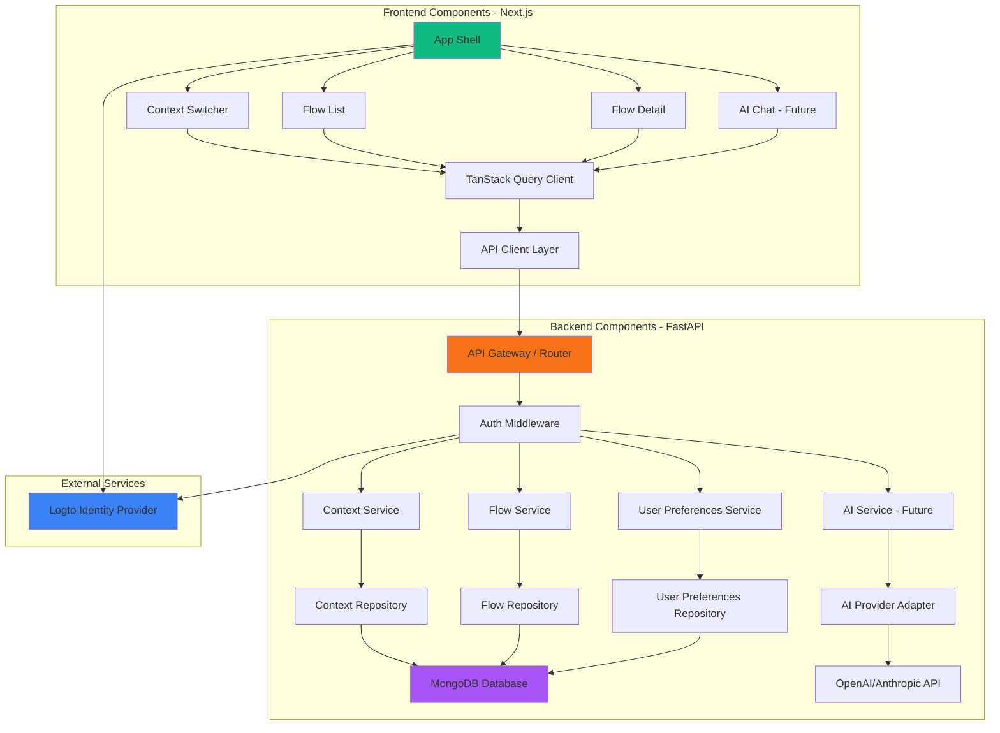

# Components

This section defines the major logical components across both frontend and backend, their responsibilities, interfaces, and dependencies.

## Component Architecture Overview



---

## Frontend Components

### 1. App Shell (Server Component)

**Responsibility:** Root layout providing global navigation, context switcher UI, and authentication state. Renders as React Server Component for optimal performance.

**Key Interfaces:**
- Fetches user contexts on server-side (no client JS needed)
- Provides current context ID via React Context to descendants
- Renders Logto authentication UI when unauthenticated

**Dependencies:**
- Logto Next.js SDK for auth checks
- API Client Layer for server-side data fetching
- CSS Design Tokens for context theming

**Technology Specifics:**
- Next.js 15 App Router `layout.tsx`
- Server Component (default)
- Reads Logto session via middleware
- Sets CSS custom property `--color-accent-current` based on active context

**File Location:** `my_flow_client/src/app/layout.tsx`

---

### 2. Context Switcher (Client Component)

**Responsibility:** Interactive dropdown/modal for selecting active context, creating new contexts, and managing context settings. Requires client-side interactivity for state management.

**Key Interfaces:**
- `onContextSwitch(contextId: string)`: Callback when context changes
- `onContextCreate(context: ContextCreate)`: Mutation for new context
- Exposes current context ID via React Context

**Dependencies:**
- TanStack Query for context list caching and mutations
- React Context for broadcasting context changes to app
- shadcn/ui Dropdown or Dialog components

**Technology Specifics:**
- Client Component (`'use client'`)
- Uses `useMutation` for context CRUD
- Uses `useContext` to read/write global context state
- Optimistic updates on context switch (<500ms perceived latency per NFR-2)

**File Location:** `my_flow_client/src/components/context-switcher.tsx`

---

### 3. Flow List (Hybrid - Server + Client Components)

**Responsibility:** Displays all flows for the active context with filtering, sorting, and completion toggling. Server Component for initial render, Client Component for interactions.

**Key Interfaces:**
- Accepts `contextId` prop from parent
- Renders Flow cards with completion checkbox, priority badge, due date indicator
- Supports query params: `?completed=true`, `?priority=high`

**Dependencies:**
- TanStack Query for flow list caching and real-time updates
- Flow Detail component for drill-down navigation
- API Client Layer for flow queries

**Technology Specifics:**
- Hybrid architecture:
  - `flow-list.tsx` (Server Component) - Initial SSR data fetch
  - `flow-list-interactive.tsx` (Client Component) - Checkbox interactions, filtering
- Uses `useQuery` with automatic refetch on context switch
- Optimistic completion toggle via `useMutation`

**File Location:** `my_flow_client/src/components/flows/flow-list.tsx`

---

### 4. Flow Detail (Server Component with Client Islands)

**Responsibility:** Detailed view of a single flow with edit capabilities, due date picker, description editor. Primarily Server Component with Client Component islands for form inputs.

**Key Interfaces:**
- Accepts `flowId` param from route
- Renders markdown description, priority selector, due date picker
- Supports inline editing with auto-save

**Dependencies:**
- TanStack Query for flow detail fetching
- shadcn/ui Form components (Calendar, Select, Textarea)
- API Client Layer for flow mutations

**Technology Specifics:**
- Hybrid architecture:
  - `flow-detail.tsx` (Server Component) - Initial data fetch
  - `flow-edit-form.tsx` (Client Component) - Interactive form inputs
- Uses `useMutation` with debounced auto-save (500ms delay)
- Form validation via React Hook Form + Zod

**File Location:** `my_flow_client/src/app/contexts/[context_id]/flows/[flow_id]/page.tsx`

---

### 5. AI Chat Interface (Client Component - Future Epic 3)

**Responsibility:** Real-time conversational AI interface for flow extraction. Streams AI responses with markdown rendering and flow creation actions.

**Key Interfaces:**
- `onMessageSend(message: string)`: Send user message to AI
- `onFlowExtract(flows: FlowCreate[])`: Callback when AI suggests flows
- Displays streaming response with typing indicator

**Dependencies:**
- Server-Sent Events (SSE) or WebSocket connection to AI Service
- TanStack Query for flow mutations (extracted flows)
- Markdown renderer (react-markdown)

**Technology Specifics:**
- Client Component (`'use client'`)
- Uses `EventSource` API for SSE streaming
- Optimistic UI updates for extracted flows
- Auto-scrolls to bottom on new messages

**File Location:** `my_flow_client/src/components/ai/chat-interface.tsx` (Future)

---

### 6. TanStack Query Client (State Management Layer)

**Responsibility:** Manages all server state caching, request deduplication, optimistic updates, and automatic refetching. Acts as single source of truth for API data.

**Key Interfaces:**
- Query keys: `['contexts', userId]`, `['flows', contextId]`, `['preferences', userId]`
- Mutation functions for CRUD operations
- Cache invalidation on mutations

**Dependencies:**
- API Client Layer for HTTP requests
- React Context for current context ID (affects query keys)

**Technology Specifics:**
- Configured in `my_flow_client/src/lib/query-client.ts`
- Default `staleTime`: 5 minutes (contexts), 1 minute (flows)
- Default `cacheTime`: 10 minutes
- Automatic retry with exponential backoff (3 attempts)
- Optimistic update patterns for instant feedback

**Configuration Example:**
```typescript
export const queryClient = new QueryClient({
  defaultOptions: {
    queries: {
      staleTime: 60 * 1000, // 1 minute
      cacheTime: 10 * 60 * 1000, // 10 minutes
      retry: 3,
      refetchOnWindowFocus: true,
    },
    mutations: {
      onError: (error) => {
        toast.error(`Mutation failed: ${error.message}`);
      },
    },
  },
});
```

---

### 7. BFF Proxy Layer (Next.js API Routes)

**Responsibility:** Acts as Backend-for-Frontend (BFF) proxy between browser and FastAPI backend. **Critical:** Browser code NEVER calls FastAPI directly - all requests go through Next.js API routes which handle JWT token retrieval and forwarding.

**Architecture Pattern:**
```
Browser → Next.js API Routes (/api/*) → FastAPI Backend (/api/v1/*)
   (session cookie)  →  (JWT token server-side)  →  (validates JWT)
```

**Key API Routes:**
- `GET /api/flows` → proxies to `GET /api/v1/flows`
- `POST /api/flows` → proxies to `POST /api/v1/flows`
- `PATCH /api/flows/:id` → proxies to `PATCH /api/v1/flows/:id`
- `DELETE /api/flows/:id` → proxies to `DELETE /api/v1/flows/:id`
- `POST /api/chat/stream` → proxies SSE stream from `/api/v1/conversations/stream`

**Dependencies:**
- Logto Next.js SDK for server-side token retrieval (`getApiAccessToken`)
- FastAPI backend URL from environment variable (`API_BASE_URL`)

**Technology Specifics:**
- Uses Next.js App Router API routes (route handlers)
- JWT tokens retrieved server-side only (NEVER exposed to browser)
- Proxies requests/responses transparently
- Supports SSE streaming for AI chat
- Browser only uses session cookies (HttpOnly, Secure)

**File Locations:** 
- `my_flow_client/src/app/api/flows/route.ts`
- `my_flow_client/src/app/api/flows/[id]/route.ts`
- `my_flow_client/src/app/api/chat/stream/route.ts`

**Implementation Pattern:**

```typescript
// app/api/flows/route.ts
import { getApiAccessToken } from '@logto/next/server-actions';
import { NextResponse } from 'next/server';

const API_BASE_URL = process.env.API_BASE_URL; // FastAPI URL

export async function GET() {
  // 1. Get JWT token server-side (never exposed to browser)
  const token = await getApiAccessToken();
  
  if (!token) {
    return NextResponse.json({ error: 'Unauthorized' }, { status: 401 });
  }
  
  // 2. Call FastAPI with JWT token
  const response = await fetch(`${API_BASE_URL}/api/v1/flows`, {
    headers: {
      'Authorization': `Bearer ${token}`,
      'Content-Type': 'application/json',
    },
  });
  
  if (!response.ok) {
    return NextResponse.json(
      { error: 'Backend error' },
      { status: response.status }
    );
  }
  
  // 3. Proxy response back to browser (without token)
  const data = await response.json();
  return NextResponse.json(data);
}

export async function POST(request: Request) {
  const token = await getApiAccessToken();
  const body = await request.json();
  
  const response = await fetch(`${API_BASE_URL}/api/v1/flows`, {
    method: 'POST',
    headers: {
      'Authorization': `Bearer ${token}`,
      'Content-Type': 'application/json',
    },
    body: JSON.stringify(body),
  });
  
  return NextResponse.json(await response.json(), {
    status: response.status,
  });
}
```

**SSE Streaming Pattern:**

```typescript
// app/api/chat/stream/route.ts
export async function POST(request: Request) {
  const token = await getApiAccessToken();
  const body = await request.json();
  
  // Stream from FastAPI with JWT
  const upstreamResponse = await fetch(
    `${API_BASE_URL}/api/v1/conversations/stream`,
    {
      method: 'POST',
      headers: { 
        'Authorization': `Bearer ${token}`,
        'Content-Type': 'application/json',
      },
      body: JSON.stringify(body),
    }
  );
  
  // Pipe stream back to browser (token never exposed)
  const { readable, writable } = new TransformStream<Uint8Array>();
  upstreamResponse.body!.pipeTo(writable);
  
  return new Response(readable, {
    headers: {
      'Content-Type': 'text/event-stream',
      'Cache-Control': 'no-cache',
      'Connection': 'keep-alive',
    },
  });
}
```

**Browser-Side Usage:**

```typescript
// ✅ CORRECT: Browser calls Next.js proxy
const response = await fetch('/api/flows');
const flows = await response.json();

// ❌ WRONG: Browser calling FastAPI directly
const response = await fetch('https://api.myflow.app/api/v1/flows', {
  headers: { Authorization: `Bearer ${token}` } // Token exposed!
});
```

**Security Benefits:**
1. JWT tokens NEVER exposed to browser
2. Session cookies are HttpOnly, Secure, SameSite=Lax
3. Token refresh handled server-side by Logto SDK
4. No CORS configuration needed
5. Backend URL abstracted from frontend

---

## Backend Components

### 8. API Gateway / Router (FastAPI)

**Responsibility:** Central entry point for all API requests. Routes requests to appropriate service layer, applies middleware (auth, CORS, rate limiting), and returns responses.

**Key Interfaces:**
- Exposes all REST endpoints defined in API Specification
- Returns JSON responses with appropriate HTTP status codes
- Handles request validation via Pydantic schemas

**Dependencies:**
- Auth Middleware for JWT validation
- Service layer components (Context, Flow, UserPreferences, AI services)
- Pydantic models for request/response validation

**Technology Specifics:**
- FastAPI `APIRouter` for modular endpoint organization
- Automatic OpenAPI schema generation
- Dependency injection for services and database connections
- CORS middleware for Next.js origin

**File Location:** `my_flow_api/src/routers/`

**Structure:**
```
my_flow_api/src/routers/
├── contexts.py       # Context CRUD endpoints
├── flows.py          # Flow CRUD + due date endpoints
├── preferences.py    # UserPreferences endpoints
└── ai.py             # AI chat streaming (future)
```

---

### 9. Auth Middleware (FastAPI Dependency)

**Responsibility:** Validates Logto JWT tokens on every request, extracts `user_id` from token claims, and injects it into request context for authorization.

**Key Interfaces:**
- `get_current_user()`: FastAPI dependency returning authenticated user ID
- Raises `HTTPException(401)` if token is invalid or expired

**Dependencies:**
- Logto JWKS endpoint for public key fetching
- `python-jose` library for JWT verification

**Technology Specifics:**
- Implemented as FastAPI dependency (`Depends(get_current_user)`)
- Caches Logto public keys in memory (1 hour TTL)
- Validates `iss`, `aud`, `exp` claims

**File Location:** `my_flow_api/src/middleware/auth.py`

**Implementation Snippet:**
```python
from fastapi import Depends, HTTPException, status
from fastapi.security import HTTPBearer, HTTPAuthorizationCredentials
from jose import jwt, JWTError
import httpx

security = HTTPBearer()

async def get_current_user(credentials: HTTPAuthorizationCredentials = Depends(security)) -> str:
    token = credentials.credentials

    try:
        # Fetch Logto JWKS and verify token
        payload = jwt.decode(
            token,
            key=get_logto_public_key(),  # Cached
            algorithms=["RS256"],
            audience=settings.LOGTO_APP_ID,
            issuer=settings.LOGTO_ENDPOINT,
        )
        user_id: str = payload.get("sub")
        if not user_id:
            raise HTTPException(status_code=401, detail="Invalid token")
        return user_id
    except JWTError:
        raise HTTPException(status_code=401, detail="Invalid or expired token")
```

---

### 10. Context Service

**Responsibility:** Business logic for context management - CRUD operations, validation, and ownership checks. Orchestrates repository calls and enforces business rules.

**Key Interfaces:**
- `async def get_contexts(user_id: str) -> list[Context]`
- `async def create_context(user_id: str, context: ContextCreate) -> Context`
- `async def update_context(context_id: str, user_id: str, update: ContextUpdate) -> Context`
- `async def delete_context(context_id: str, user_id: str) -> None`

**Dependencies:**
- Context Repository for database operations
- Flow Repository for cascade deletes

**Technology Specifics:**
- Pure async Python functions
- Raises `ValueError` for business rule violations (converted to HTTP errors by router)
- Validates ownership before mutations

**File Location:** `my_flow_api/src/services/context_service.py`

---

### 11. Flow Service

**Responsibility:** Business logic for flow management - CRUD, status computation (overdue/due_soon), reminder queries, and completion tracking.

**Key Interfaces:**
- `async def get_flows(context_id: str, user_id: str, filters: FlowFilters) -> list[FlowWithStatus]`
- `async def get_due_flows(user_id: str, days: int) -> list[FlowWithStatus]`
- `async def create_flow(user_id: str, flow: FlowCreate) -> Flow`
- `async def toggle_completion(flow_id: str, user_id: str) -> Flow`

**Dependencies:**
- Flow Repository for database operations
- Context Service for context ownership validation

**Technology Specifics:**
- Computes `status` and `days_until_due` fields dynamically
- Uses `datetime` for due date calculations (timezone-aware)
- Supports filtering by `completed`, `priority`, `due_date` range

**File Location:** `my_flow_api/src/services/flow_service.py`

**Status Computation Logic:**
```python
from datetime import datetime, timedelta

def compute_flow_status(flow: Flow) -> tuple[str, int | None]:
    if not flow.due_date:
        return ("normal", None)

    now = datetime.utcnow()
    due = datetime.fromisoformat(flow.due_date)
    delta = (due - now).days

    if delta < 0:
        return ("overdue", delta)
    elif delta == 0:
        return ("due_today", 0)
    elif delta <= 3:
        return ("due_soon", delta)
    else:
        return ("normal", delta)
```

---

### 12. User Preferences Service

**Responsibility:** Manages user preferences with auto-creation on first access. Merges partial updates with existing preferences.

**Key Interfaces:**
- `async def get_preferences(user_id: str) -> UserPreferences` (auto-creates if not found)
- `async def update_preferences(user_id: str, update: UserPreferencesUpdate) -> UserPreferences`

**Dependencies:**
- User Preferences Repository for database operations

**Technology Specifics:**
- Implements auto-creation pattern: GET creates default preferences if missing
- Uses deep merge for nested object updates (notification_preferences, ui_preferences)

**File Location:** `my_flow_api/src/services/preferences_service.py`

---

### 13. AI Service (Future - Epic 3)

**Responsibility:** Orchestrates AI conversation flow, streams responses to frontend, extracts flows from conversation using function calling, and manages conversation history.

**Key Interfaces:**
- `async def stream_chat(context_id: str, user_id: str, message: str) -> AsyncGenerator[str, None]`
- `async def extract_flows(conversation: Conversation) -> list[FlowCreate]`

**Dependencies:**
- AI Provider Adapter for OpenAI/Anthropic API calls
- Conversation Repository for history persistence
- Flow Service for creating extracted flows

**Technology Specifics:**
- Uses Server-Sent Events (SSE) for streaming
- Implements function calling for structured flow extraction
- Maintains conversation context window (last 10 messages)

**File Location:** `my_flow_api/src/services/ai_service.py` (Future)

---

### 14. Context Repository

**Responsibility:** Abstracts MongoDB operations for Context collection. Provides async CRUD interface with Motor driver.

**Key Interfaces:**
- `async def find_by_user(user_id: str) -> list[Context]`
- `async def create(context: ContextCreate, user_id: str) -> Context`
- `async def update(context_id: str, update: ContextUpdate) -> Context | None`
- `async def delete(context_id: str) -> bool`

**Dependencies:**
- Motor async MongoDB client
- Contexts collection (`db.contexts`)

**Technology Specifics:**
- Uses Motor's `AsyncIOMotorClient` for async operations
- Converts MongoDB `_id` ObjectId to string `id` field
- Raises `NotFoundError` if document doesn't exist

**File Location:** `my_flow_api/src/repositories/context_repository.py`

---

### 15. Flow Repository

**Responsibility:** Abstracts MongoDB operations for Flow collection. Supports complex queries with filters, sorting, and due date range searches.

**Key Interfaces:**
- `async def find_by_context(context_id: str, filters: FlowFilters) -> list[Flow]`
- `async def find_due_flows(user_id: str, days: int, include_overdue: bool) -> list[Flow]`
- `async def create(flow: FlowCreate, user_id: str) -> Flow`
- `async def toggle_completion(flow_id: str) -> Flow | None`

**Dependencies:**
- Motor async MongoDB client
- Flows collection (`db.flows`)

**Technology Specifics:**
- Uses compound indexes for optimized queries
- Supports cascade delete when context is deleted (via foreign key constraint)
- Implements date range queries with MongoDB `$gte`, `$lte` operators

**File Location:** `my_flow_api/src/repositories/flow_repository.py`

---

### 16. User Preferences Repository

**Responsibility:** Abstracts MongoDB operations for UserPreferences collection. Enforces unique constraint on `user_id`.

**Key Interfaces:**
- `async def find_by_user(user_id: str) -> UserPreferences | None`
- `async def create(preferences: UserPreferencesCreate) -> UserPreferences`
- `async def update(user_id: str, update: UserPreferencesUpdate) -> UserPreferences`

**Dependencies:**
- Motor async MongoDB client
- User_preferences collection (`db.user_preferences`)

**Technology Specifics:**
- Unique index on `user_id` field
- Uses MongoDB `$set` operator for partial updates
- Returns full document after update

**File Location:** `my_flow_api/src/repositories/preferences_repository.py`

---

### 17. AI Provider Adapter (Future - Epic 3)

**Responsibility:** Abstracts OpenAI/Anthropic API differences, providing unified interface for streaming chat completions and function calling.

**Key Interfaces:**
- `async def stream_completion(messages: list[Message], functions: list[Function]) -> AsyncGenerator[str, None]`
- `async def extract_structured_data(prompt: str, schema: dict) -> dict`

**Dependencies:**
- OpenAI Python SDK or Anthropic SDK (configurable via env var)

**Technology Specifics:**
- Implements adapter pattern for provider switching
- Uses streaming endpoints for real-time responses
- Converts function calling schemas to provider-specific formats

**File Location:** `my_flow_api/src/adapters/ai_provider.py` (Future)

---

## Cross-Cutting Concerns

### Error Handling Strategy
- **Frontend:** TanStack Query error callbacks display toast notifications via shadcn/ui
- **Backend:** Custom exception handlers convert service-layer errors to HTTP responses (404, 400, 401)

### Logging and Observability
- **Frontend:** Vercel Analytics for Web Vitals, error boundaries for component crashes
- **Backend:** Python `logging` module with JSON structured logs, Railway captures stdout

### Testing Boundaries
- **Frontend:** Vitest for hooks and utilities, React Testing Library for components, Playwright for E2E
- **Backend:** pytest for services and repositories (mock Motor client), pytest-asyncio for async tests

---
