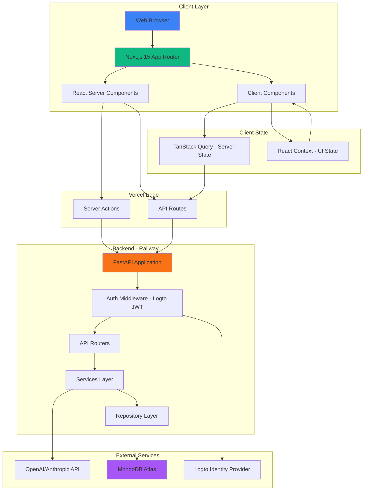

# High Level Architecture

## Technical Summary

My Flow is a context-aware task management application built as a modern fullstack monorepo. The architecture leverages **Next.js 15 React Server Components** for optimal performance and minimal client-side JavaScript, with a **FastAPI Python backend** providing RESTful APIs and AI integration. The system uses **MongoDB** for flexible document storage, **Logto** for authentication, and **OpenAI/Anthropic** for conversational AI capabilities.

The frontend adopts a **server-first rendering strategy**, where all components default to Server Components unless interactivity or browser APIs require client-side execution. This reduces bundle size, improves initial load performance, and keeps sensitive logic server-side. Client Components are strategically used only for state management (context switching, real-time chat updates) and interactive UI elements (forms, modals, animations).

**CSS design tokens** (custom properties) form the foundation of the theming system, with context-specific accent colors dynamically applied at runtime. Tailwind CSS consumes these tokens, enabling consistent styling while maintaining the flexibility to theme contexts programmatically.

The backend follows a **layered architecture** (routers → services → repositories) with async MongoDB operations via Motor. AI flow extraction happens server-side with streaming responses delivered to the frontend via Server-Sent Events (SSE) or WebSockets.

## Platform and Infrastructure Choice

**Platform:** Vercel + Railway + MongoDB Atlas
**Key Services:**
- **Frontend:** Vercel (Next.js hosting, CDN, edge functions)
- **Backend:** Railway (FastAPI container, persistent processes)
- **Database:** MongoDB Atlas M0 (512MB free tier)
- **Auth:** Logto Cloud (managed identity provider)
- **AI:** OpenAI API or Anthropic Claude API (streaming capable)
- **Secrets:** 1Password CLI (`op`) for environment variable management

**Deployment Host and Regions:**
- Vercel: Global CDN with edge functions (automatic region selection)
- Railway: US-West or US-East (select closest to primary user base)
- MongoDB Atlas: Same region as Railway for minimal latency

## Repository Structure

**Structure:** Monorepo
**Monorepo Tool:** Bun workspaces (lightweight, fast, native TypeScript support)
**Package Organization:**

```
my_flow_app/
├── my_flow_client/          # Next.js 15 frontend (workspace)
├── my_flow_api/             # FastAPI backend (workspace)
├── packages/
│   └── shared-types/        # Shared TypeScript types (future)
├── docs/                    # PRD, architecture, specs
├── scripts/                 # Deployment and utility scripts
├── .github/                 # CI/CD workflows
├── bun.lockb               # Bun lock file
└── package.json            # Root workspace config
```

## High Level Architecture Diagram



## Architectural Patterns

- **Server-First Rendering (Next.js RSC):** Default to React Server Components for all pages and layouts; render on server, stream HTML to client. Client Components only when state, effects, or browser APIs required. _Rationale:_ Minimizes JavaScript bundle size, improves SEO, keeps API keys server-side, reduces Time to Interactive (TTI).

- **Backend for Frontend (BFF) Pattern:** Next.js API routes act as a thin proxy layer between frontend and FastAPI backend when needed for server-side data fetching or auth token forwarding. _Rationale:_ Enables Server Components to fetch data securely, consolidates authentication headers, abstracts backend URL changes.

- **Repository Pattern (Backend):** Abstract database operations into repository classes (`ContextRepository`, `FlowRepository`) with async MongoDB operations. _Rationale:_ Enables unit testing with mock repositories, isolates database logic, simplifies migration to different databases if needed.

- **Service Layer (Backend):** Business logic resides in service classes (`ContextService`, `FlowService`, `AIService`) that orchestrate repository calls and external API interactions. _Rationale:_ Separates business rules from HTTP concerns, reusable across different API endpoints, testable independently.

- **CSS Design Tokens Foundation:** All visual properties (colors, spacing, typography, shadows) defined as CSS custom properties in `:root`. Tailwind CSS configured to consume these tokens. _Rationale:_ Enables dynamic theming (context accent colors), consistent design system, single source of truth for styling, AI agents can modify tokens without touching component code.

- **Optimistic UI Updates:** Client-side mutations update UI immediately using TanStack Query's optimistic update hooks, rollback on API error. _Rationale:_ Meets PRD requirement for instant feedback (NFR-2: <500ms context switching), improves perceived performance, reduces user frustration.

- **Streaming AI Responses:** AI inference results streamed from FastAPI backend to frontend via Server-Sent Events (SSE) or WebSocket, rendered incrementally in Client Component. _Rationale:_ Meets PRD requirement for real-time streaming (NFR-1: <2s latency), provides natural conversational feel, reduces perceived wait time.
