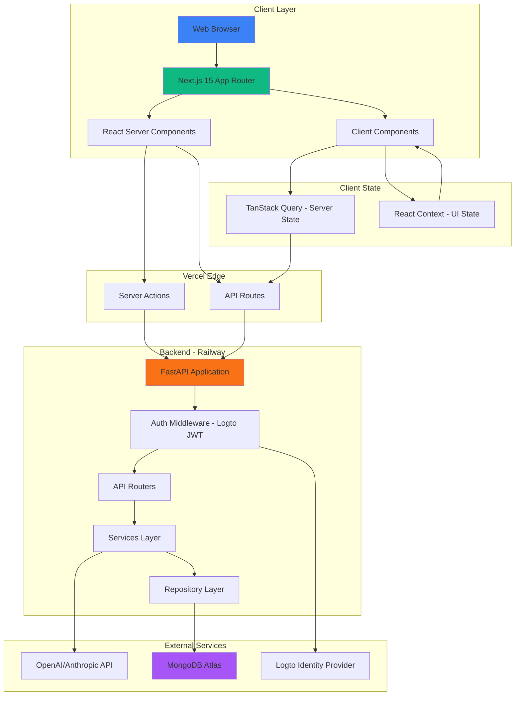

# High Level Architecture

## Technical Summary

My Flow is a context-aware task management application built as a modern fullstack monorepo. The architecture leverages **Next.js 15 with React 19 Server Components** for optimal performance and minimal client-side JavaScript, with a **FastAPI Python backend** providing RESTful APIs and AI integration. The system uses **MongoDB** (Motor async driver) for flexible document storage, **Logto** for authentication via OAuth 2.0 + JWT, and **OpenAI/Anthropic** for conversational AI capabilities (to be integrated).

The frontend adopts a **server-first rendering strategy** using Next.js App Router, where all components default to Server Components unless interactivity or browser APIs require client-side execution. This reduces bundle size, improves initial load performance, and keeps sensitive logic server-side. The application currently implements authentication flows, protected routes, and a foundational dashboard with user session management.

**CSS design tokens** (custom properties) form the foundation of the theming system, organized in a **three-layer architecture** (primitives → semantic → component-specific). Context-specific accent colors are dynamically applied at runtime through CSS custom properties. **Tailwind CSS 4.x** consumes these tokens, enabling consistent styling while maintaining the flexibility to theme contexts programmatically. The design system includes comprehensive token files for colors, typography, spacing, effects, and animations.

The backend follows a **layered architecture** with FastAPI as the application framework, implementing JWT authentication middleware that validates Logto-issued tokens. The system uses async MongoDB operations via Motor driver with proper connection lifecycle management (startup/shutdown). The architecture supports health checks with database connectivity validation.

## Platform and Infrastructure Choice

**Platform:** Vercel (Planned) + Railway (Planned) + MongoDB Atlas
**Current Development Infrastructure:**
- **Frontend:** Local development with Next.js 15 dev server (Turbopack enabled)
- **Backend:** Local FastAPI server with uvicorn (auto-reload enabled)
- **Database:** MongoDB Atlas (free tier M0) or local MongoDB instance
- **Auth:** Logto Cloud (OAuth 2.0 + JWT)
- **Secrets:** 1Password CLI (`op`) for secure local environment variable management
- **Build Tools:** Bun 1.x (frontend), uv (backend Python package manager)

**Planned Production Services:**
- **Frontend:** Vercel (Next.js hosting, CDN, edge functions)
- **Backend:** Railway (FastAPI container deployment)
- **AI:** OpenAI API or Anthropic Claude API (to be integrated)

**Deployment Regions (Planned):**
- Vercel: Global CDN with automatic region selection
- Railway: US-West or US-East
- MongoDB Atlas: Same region as Railway backend

## Repository Structure

**Structure:** Monorepo
**Monorepo Tool:** Bun workspaces (lightweight, fast, native TypeScript support)
**Package Organization:**

```
my_flow_app/
├── my_flow_client/                      # Next.js 15 frontend (Bun workspace)
│   ├── src/
│   │   ├── app/                        # Next.js App Router
│   │   │   ├── (auth)/                 # Auth routes (login, callback)
│   │   │   ├── api/logto/              # Logto API routes
│   │   │   ├── dashboard/              # Protected dashboard
│   │   │   ├── styles/tokens/          # CSS design tokens
│   │   │   ├── globals.css             # Global styles + Tailwind import
│   │   │   ├── layout.tsx              # Root layout
│   │   │   └── page.tsx                # Home page
│   │   ├── components/
│   │   │   ├── ui/                     # shadcn/ui components (Button, etc)
│   │   │   └── navigation.tsx          # App navigation (Server Component)
│   │   ├── lib/                        # Utilities, API client, auth helpers
│   │   ├── hooks/                      # Custom React hooks
│   │   └── types/                      # TypeScript type definitions
│   ├── tests/                          # Vitest unit tests
│   ├── e2e/                            # Playwright E2E tests
│   ├── tailwind.config.ts              # Tailwind 4.x configuration
│   ├── next.config.ts                  # Next.js configuration
│   └── package.json
│
├── my_flow_api/                         # FastAPI backend (Python uv project)
│   ├── src/
│   │   ├── main.py                     # FastAPI app + lifespan events
│   │   ├── config.py                   # Pydantic Settings
│   │   ├── database.py                 # MongoDB connection (Motor)
│   │   ├── middleware/
│   │   │   └── auth.py                 # Logto JWT authentication
│   │   ├── models/                     # Pydantic schemas (future)
│   │   ├── routers/                    # API endpoints (future)
│   │   ├── services/                   # Business logic (future)
│   │   ├── repositories/               # Data access layer (future)
│   │   └── adapters/                   # External integrations (future)
│   ├── tests/
│   │   ├── unit/                       # Unit tests (pytest)
│   │   └── integration/                # Integration tests
│   ├── pyproject.toml                  # uv project config
│   └── .venv/                          # Python virtual environment
│
├── packages/                            # Shared packages (future expansion)
├── docs/                                # Documentation
│   ├── prd.md                          # Product Requirements Document
│   ├── architecture/                   # Architecture documentation
│   └── stories/                        # User stories (Story 1.1-1.5)
├── scripts/                             # Utility scripts
├── .github/                             # CI/CD workflows (future)
├── .husky/                              # Git hooks (lint-staged)
├── .env.template                        # Environment variable template (1Password refs)
├── bun.lockb                            # Bun lockfile
├── package.json                         # Root workspace configuration
└── README.md                            # Project documentation
```

## High Level Architecture Diagram



## Architectural Patterns

- **Server-First Rendering (Next.js RSC):** Default to React Server Components for all pages and layouts; render on server, stream HTML to client. Client Components only when state, effects, or browser APIs required. _Rationale:_ Minimizes JavaScript bundle size, improves SEO, keeps API keys server-side, reduces Time to Interactive (TTI).

- **Backend for Frontend (BFF) Pattern:** Next.js API routes act as a security proxy layer between browser and FastAPI backend. **Critical Rule:** Browser NEVER calls FastAPI directly - all requests go through Next.js API routes which retrieve JWT tokens server-side and forward requests with authentication. _Rationale:_ JWT tokens never exposed to browser (only session cookies), eliminates token refresh logic in browser, abstracts backend URL changes, prevents CORS complexity, enables secure Server Component data fetching.

- **Repository Pattern (Backend):** Abstract database operations into repository classes (`ContextRepository`, `FlowRepository`) with async MongoDB operations. _Rationale:_ Enables unit testing with mock repositories, isolates database logic, simplifies migration to different databases if needed.

- **Service Layer (Backend):** Business logic resides in service classes (`ContextService`, `FlowService`, `AIService`) that orchestrate repository calls and external API interactions. _Rationale:_ Separates business rules from HTTP concerns, reusable across different API endpoints, testable independently.

- **CSS Design Tokens Foundation:** Three-layer token architecture (primitives → semantic → component-specific) defined as CSS custom properties. Tokens organized in separate files (`colors.css`, `typography.css`, `spacing.css`, `effects.css`, `animation.css`) and imported via `@layer` for proper cascade control. Tailwind CSS 4.x configured to consume these tokens. _Rationale:_ Enables dynamic theming (context accent colors), consistent design system, single source of truth for styling, maintainable style evolution.

- **Server Actions Pattern:** Next.js Server Actions used for form submissions and server-side mutations (e.g., sign-out functionality). _Rationale:_ Eliminates need for API routes for simple mutations, maintains server-side execution, progressive enhancement support.

- **Optimistic UI Updates (Future):** Client-side mutations will update UI immediately using TanStack Query's optimistic update hooks with rollback on error. _Rationale:_ Will meet PRD requirement for instant feedback (NFR-2: <500ms context switching), improves perceived performance.

- **Streaming AI Responses (Future):** AI inference results will stream from FastAPI backend to frontend via Server-Sent Events (SSE), rendered incrementally in Client Component. _Rationale:_ Will meet PRD requirement for real-time streaming (NFR-1: <2s latency), provides natural conversational feel.
