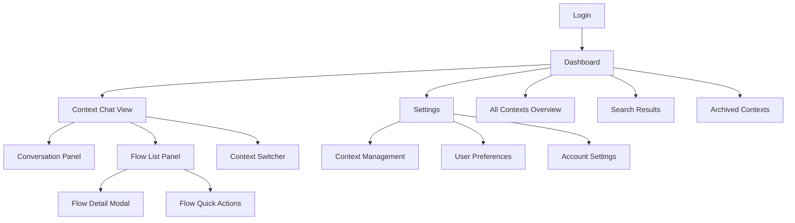
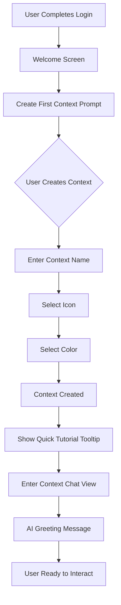
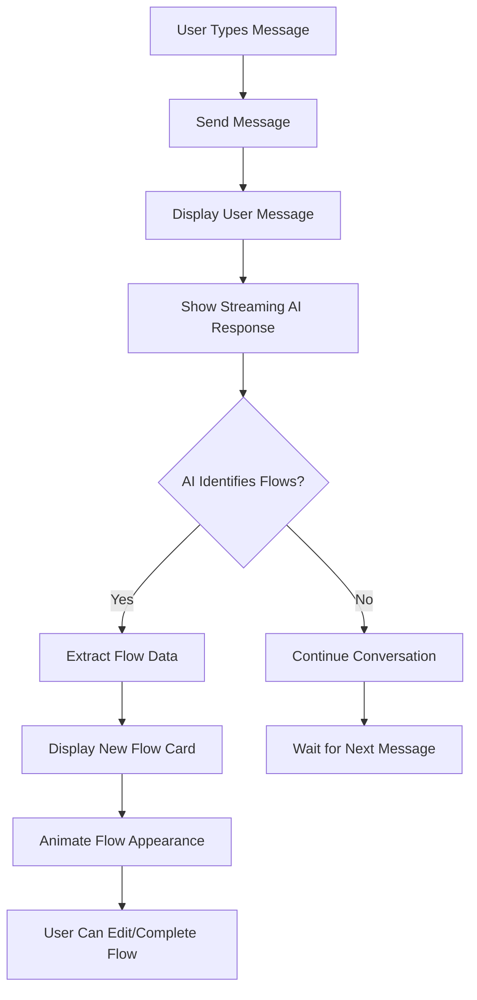
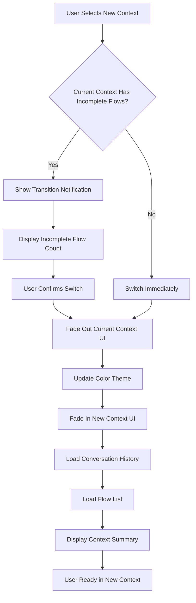

# My Flow UI/UX Specification

## Introduction

This document defines the user experience goals, information architecture, user flows, and visual design specifications for My Flow's user interface. It serves as the foundation for visual design and frontend development, ensuring a cohesive and user-centered experience.

### Overall UX Goals & Principles

#### Target User Personas

1. **The Context Juggler:** Professionals managing multiple projects and personal responsibilities simultaneously. They value efficiency and clear visual separation between contexts. Technical comfort level: medium to high.

2. **The Conversational Planner:** Users who think out loud and prefer natural conversation over structured task entry. They appreciate AI assistance in organizing their thoughts into actionable items.

3. **The Flow State Seeker:** Individuals highly sensitive to context-switching costs who need minimal friction when transitioning between life domains. They prioritize speed and continuity.

#### Usability Goals

- **Instant Context Recognition:** Users can identify their current context within 1 second through color, icon, and visual cues
- **Rapid Context Switching:** Context transitions complete in under 500ms with zero data loss
- **Natural Conversation Flow:** Users can express tasks conversationally without learning structured syntax
- **Zero-Friction Flow Management:** Users can complete, edit, or dismiss flows with single-click actions
- **Continuity Preservation:** Returning users immediately understand where they left off in each context

#### Design Principles

1. **Context is King** - Every visual element reinforces which context the user is in
2. **Conversation Over Forms** - Prioritize natural language interaction; offer structured input as fallback
3. **Instant Feedback, Zero Waiting** - Optimistic UI updates; never show spinners for user actions
4. **Dark and Focused** - Embrace dark mode to reduce cognitive load and eye strain
5. **Accessible by Design** - Keyboard navigation and screen reader support are first-class concerns

#### Change Log

| Date | Version | Description | Author |
|------|---------|-------------|--------|
| 2025-09-30 | 1.0 | Initial UI/UX Specification | Sally (UX Expert) |

## Information Architecture (IA)

### Site Map / Screen Inventory

### Navigation Structure

**Primary Navigation:** The Context Switcher serves as primary navigation, always visible in the header/sidebar. Users select a context to enter that context's chat view. The dashboard icon provides access to the overview of all contexts.

**Secondary Navigation:** Within Context Chat View: Toggle between "Conversation" and "Flow List" panels (on mobile/tablet). Settings accessible via user menu in top-right corner.

**Breadcrumb Strategy:** Minimal breadcrumbs: `Dashboard > [Context Name]` or `Dashboard > Settings > [Settings Section]`. Given the flat IA and context-first paradigm, deep breadcrumbs aren't necessary. The visible context indicator (color/icon) serves as spatial orientation.

## User Flows

### Flow 1: First-Time User Onboarding & Context Creation

**User Goal:** New user creates their first context and understands how to use the app

**Entry Points:** Post-authentication, first login

**Success Criteria:** User has created at least one context with name, icon, and color; understands they can chat with AI to create flows

#### Flow Diagram

#### Edge Cases & Error Handling:

- User closes onboarding early → Save partial progress, allow resume later
- User enters invalid/empty context name → Inline validation, prevent submission
- User creates duplicate context name → Warning message, suggest alternate name
- Network failure during creation → Optimistic UI, retry in background, show error if fails

**Notes:** First impression is critical. The onboarding should be lightweight (max 3 steps) and demonstrate value immediately. Consider showing 1-2 example contexts ("Work", "Personal") that user can adopt with one click.

### Flow 2: Creating Flows via AI Conversation

**User Goal:** User expresses tasks naturally in conversation; AI extracts and structures them as flows

**Entry Points:** Context Chat View, conversation input

**Success Criteria:** User sees extracted flows appear in the Flow List Panel; flows are actionable and accurately represent intent

#### Flow Diagram

#### Edge Cases & Error Handling:

- AI misinterprets user intent → User can edit flow details or delete flow
- AI extracts duplicate flow → Deduplicate based on similarity threshold, ask user to confirm
- AI service unavailable → Show graceful error, store message for retry, allow manual flow creation
- User rapid-fires multiple messages → Queue messages, process in order, batch flow extraction

**Notes:** The magic of My Flow happens here. Response streaming is essential for natural feel. Consider showing a subtle "AI is thinking..." indicator. Flow cards should animate in smoothly (slide + fade) to draw attention without being jarring.

### Flow 3: Context Switching with Flow State Preservation

**User Goal:** Switch from one context to another without losing track of progress

**Entry Points:** Context Switcher dropdown, keyboard shortcut, dashboard context card

**Success Criteria:** New context loads in <500ms; conversation history and flows are intact; user receives transition summary if switching from context with incomplete flows

#### Flow Diagram

#### Edge Cases & Error Handling:

- Context data fails to load → Show cached version if available, retry in background
- User switches contexts rapidly (spam clicking) → Debounce switches, queue only latest request
- Incomplete flows in multiple contexts → Show aggregated count in context switcher badges
- First time entering a context → Show brief context-specific welcome message

**Notes:** The 500ms NFR is aggressive. Use optimistic rendering: show cached UI immediately, update with fresh data as it arrives. The color theme transition should be smooth (CSS transition on root variables). Consider preloading adjacent contexts for even faster switching.

## Wireframes & Mockups

**Primary Design Files:** To be created in Figma or similar tool (TBD - recommend Figma for component library features and developer handoff)

### Key Screen Layouts

#### Dashboard (All Contexts Overview)

**Purpose:** Provide birds-eye view of all contexts with quick access to each; show status at a glance

**Key Elements:**
- Grid/masonry layout of context cards (each showing name, icon, color, flow count, completion %)
- Global search bar at top
- "Create New Context" prominent action button
- Filter/sort options (by activity, completion, alphabetical)
- Quick stats summary (total flows, completed today, etc.)

**Interaction Notes:** Context cards are clickable to enter that context. Hover shows preview tooltip with recent activity. Right-click or long-press for context menu (archive, edit, delete). Drag-to-reorder for custom sorting.

**Design File Reference:** [Figma frame TBD]

#### Context Chat View (Primary Working Screen)

**Purpose:** Main workspace where users converse with AI and manage flows within a specific context

**Key Elements:**
- **Left sidebar (desktop) / collapsible drawer (mobile):** Context switcher dropdown at top, flow list below, context summary card at bottom
- **Center panel:** Conversation history (chat bubbles), AI streaming responses, message input field at bottom
- **Right panel (desktop only):** Context details, quick actions, relevant context metadata
- **Header:** Current context indicator (icon + color + name), breadcrumb, settings icon, user menu

**Interaction Notes:**
- Conversation scrolls to bottom on new message
- Flow cards in sidebar update in real-time as AI extracts them
- Click flow card to expand inline detail view
- Message input supports multiline (Shift+Enter), send on Enter
- Context color theming applied to accent elements (focus states, buttons, flow cards)

**Design File Reference:** [Figma frame TBD]

#### Flow Detail Modal/Panel

**Purpose:** View and edit detailed information about a specific flow

**Key Elements:**
- Flow title (editable inline)
- Full description/notes (editable textarea)
- Priority selector (low/medium/high)
- Status indicator (active/completed)
- Timestamps (created, last modified)
- Action buttons: Save, Delete, Mark Complete, Cancel

**Interaction Notes:** Opens as modal on mobile/tablet, as inline expanded card on desktop. Click outside or ESC to close. Changes save optimistically. Keyboard shortcut Cmd/Ctrl+S to save.

**Design File Reference:** [Figma frame TBD]

#### Settings Page

**Purpose:** Manage contexts, configure preferences, account settings

**Key Elements:**
- Tab navigation: Contexts, Preferences, Account
- **Contexts tab:** List of all contexts with inline edit/delete actions, create new button
- **Preferences tab:** Theme settings (though dark only for MVP), notification preferences, keyboard shortcuts reference
- **Account tab:** Profile info, connected accounts, logout

**Interaction Notes:** Standard form patterns with immediate validation. Destructive actions (delete context) require confirmation modal.

**Design File Reference:** [Figma frame TBD]

## Component Library / Design System

**Design System Approach:** Build a lightweight custom component library using CSS custom properties (design tokens) and React components. For MVP, prioritize consistency over completeness. Consider adopting shadcn/ui or Radix UI primitives for accessible base components, styled with custom theme.

### Core Components

#### Button

**Purpose:** Primary interactive element for actions throughout the application

**Variants:**
- Primary (filled, context accent color)
- Secondary (outlined, neutral)
- Ghost (text only, minimal)
- Danger (destructive actions, red accent)

**States:** Default, Hover, Active, Disabled, Loading, Focus (keyboard)

**Usage Guidelines:** Use Primary for main CTAs (send message, save context). Use Secondary for supporting actions. Use Ghost for tertiary actions that shouldn't draw attention. Always provide focus indicators for keyboard navigation. Loading state shows spinner, disables interaction.

#### Context Card

**Purpose:** Visual representation of a context in dashboard and switcher

**Variants:**
- Default (standard card view)
- Compact (list view)
- Active (currently selected context)

**States:** Default, Hover, Active, Loading

**Usage Guidelines:** Must display context icon, name, and accent color prominently. Hover state shows additional info (flow counts, last activity). Active state has distinct border/shadow. Loading state during context creation/switching.

#### Flow Card

**Purpose:** Display individual flow items in the flow list panel

**Variants:**
- Collapsed (title + status only)
- Expanded (full details visible)
- Completed (strikethrough, muted colors)

**States:** Default, Hover, Selected, Editing, Completed

**Usage Guidelines:** Collapsed by default to conserve space. Click to expand. Checkbox for quick completion. Edit icon to enter edit mode. Completed flows show checkmark and muted styling. Support drag-to-reorder.

#### Message Bubble

**Purpose:** Display conversation messages from user and AI

**Variants:**
- User message (right-aligned, context accent background)
- AI message (left-aligned, neutral background)
- System message (centered, muted)

**States:** Default, Streaming (for AI responses), Error

**Usage Guidelines:** User messages use context accent color. AI messages use neutral gray. Streaming state shows typing animation. Error state shows red indicator with retry option. Include timestamps on hover.

#### Input Field

**Purpose:** Text input for forms and message composition

**Variants:**
- Single-line (standard text input)
- Multi-line (textarea for messages)
- Search (with icon and clear button)

**States:** Default, Focus, Error, Disabled, Loading

**Usage Guidelines:** Clear focus indicators using context accent color. Error state shows red border and helper text below. Search variant includes search icon left, clear button right. Multi-line auto-expands to content (max 6 lines before scroll).

#### Modal/Dialog

**Purpose:** Present focused content or actions requiring user decision

**Variants:**
- Standard (centered, medium size)
- Full-screen (mobile only)
- Confirmation (smaller, focused on yes/no decision)

**States:** Open, Closing (fade-out animation)

**Usage Guidelines:** Dark overlay backdrop (60% opacity). Close on backdrop click, ESC key, or explicit close button. Trap focus within modal for accessibility. Use sparingly - prefer inline expansion where possible.

#### Context Switcher Dropdown

**Purpose:** Allow quick context selection from any screen

**Variants:**
- Collapsed (shows current context only)
- Expanded (shows all contexts in dropdown)

**States:** Closed, Open, Searching (if search filter active)

**Usage Guidelines:** Always visible in header/sidebar. Shows current context with icon and color. Dropdown opens on click, shows all contexts with search filter at top. Keyboard navigable (arrow keys, Enter to select). Badge shows incomplete flow counts per context.

## Branding & Style Guide

### Visual Identity

**Brand Guidelines:** My Flow uses dark mode exclusively with context-specific accent colors. All visual properties are defined as CSS design tokens (custom properties) for consistency and easy theming.

### Color Palette

| Color Type | Hex Code | Usage |
|------------|----------|-------|
| **Context Colors** | | |
| Work | `#3B82F6` | Work context accent (blue) |
| Personal | `#F97316` | Personal context accent (orange) |
| Rest | `#A855F7` | Rest context accent (purple) |
| Social | `#10B981` | Social context accent (green) |
| **Semantic Colors** | | |
| Success | `#22C55E` | Positive feedback, flow completion confirmations |
| Warning | `#EAB308` | Cautions, important notices, pending states |
| Error | `#EF4444` | Errors, destructive actions, validation failures |
| **Neutral Colors** | | |
| Background Primary | `#0A0A0A` | Main app background (deep black) |
| Background Secondary | `#1A1A1A` | Card backgrounds, elevated surfaces |
| Background Tertiary | `#2A2A2A` | Hover states, subtle elevation |
| Text Primary | `#FAFAFA` | Primary text, headings |
| Text Secondary | `#A3A3A3` | Secondary text, metadata, timestamps |
| Text Muted | `#525252` | Disabled text, placeholders |
| Border | `#404040` | Dividers, input borders, card outlines |

### Typography

#### Font Families

- **Primary:** Inter (body text, UI elements)
- **Secondary:** Inter (headings - same family for consistency)
- **Monospace:** JetBrains Mono (code snippets, technical content)

#### Type Scale

| Element | Size | Weight | Line Height |
|---------|------|--------|-------------|
| H1 | 32px | 700 (Bold) | 1.2 |
| H2 | 24px | 600 (Semibold) | 1.3 |
| H3 | 20px | 600 (Semibold) | 1.4 |
| Body | 16px | 400 (Regular) | 1.6 |
| Small | 14px | 400 (Regular) | 1.5 |
| Tiny | 12px | 500 (Medium) | 1.4 |

### Iconography

**Icon Library:** Lucide Icons (React) - Modern, consistent, and optimized for React applications

**Usage Guidelines:**
- Use 20px icons for most UI elements (buttons, cards)
- Use 24px icons for navigation and primary actions
- Use 16px icons for inline text elements
- Always pair icons with accessible labels (aria-label or visible text)
- Context icons should be 32px in dashboard cards, 24px in switcher
- Maintain consistent stroke width (2px) across all icons

### Spacing & Layout

**Grid System:** 12-column grid with 24px gutters on desktop, 16px on mobile

**Spacing Scale:** Based on 4px increments for consistency
- `--space-1`: 4px
- `--space-2`: 8px
- `--space-3`: 12px
- `--space-4`: 16px
- `--space-5`: 20px
- `--space-6`: 24px
- `--space-8`: 32px
- `--space-10`: 40px
- `--space-12`: 48px
- `--space-16`: 64px

**Container Max-Widths:**
- Dashboard: 1440px
- Context Chat View: 1200px (main content), no max-width (full viewport minus sidebars)
- Settings: 960px

**Border Radius Scale:**
- Small (buttons, badges): 6px
- Medium (cards, inputs): 8px
- Large (modals, panels): 12px
- Full (avatars, pills): 9999px

## Accessibility Requirements

### Compliance Target

**Standard:** WCAG 2.1 Level AA compliance (as specified in PRD NFR-15)

### Key Requirements

**Visual:**
- **Color contrast ratios:** Minimum 4.5:1 for normal text (16px+), 3:1 for large text (24px+). All text on colored backgrounds (context accents) must meet this standard. Use online contrast checkers during design.
- **Focus indicators:** Visible focus ring on all interactive elements with minimum 2px outline at 3:1 contrast against background. Use context accent color for focus states.
- **Text sizing:** All text must be resizable up to 200% without loss of content or functionality. Use relative units (rem/em) rather than fixed pixels in CSS.

**Interaction:**
- **Keyboard navigation:** All functionality accessible via keyboard. Tab order follows logical reading order. Skip links provided to main content. Context switcher accessible via Ctrl/Cmd+K shortcut.
- **Screen reader support:** Proper semantic HTML (nav, main, article, aside). ARIA labels for icon-only buttons. ARIA live regions for AI streaming responses and flow updates. Form inputs have associated labels.
- **Touch targets:** Minimum 44x44px tap targets on mobile for all interactive elements (buttons, links, form controls). Adequate spacing between adjacent targets (8px minimum).

**Content:**
- **Alternative text:** All images, icons with semantic meaning have descriptive alt text or aria-label. Decorative images use alt="" or aria-hidden="true".
- **Heading structure:** Logical heading hierarchy (h1 → h2 → h3, no skipping levels). One h1 per page. Headings describe content structure, not just visual styling.
- **Form labels:** Every input field has an associated label element or aria-label. Error messages linked to inputs via aria-describedby. Clear required field indicators.

### Testing Strategy

**Automated Testing:**
- Run axe-core or similar automated accessibility testing in CI/CD pipeline
- Integrate Lighthouse accessibility audits into build process (target score: 95+)
- Use ESLint jsx-a11y plugin to catch accessibility issues during development

**Manual Testing:**
- Keyboard-only navigation testing for all critical user flows
- Screen reader testing with NVDA (Windows) and VoiceOver (macOS/iOS)
- Color contrast verification using tools like WebAIM Contrast Checker
- Test with browser zoom at 200%
- Test with Windows High Contrast Mode enabled

**User Testing:**
- If possible, include users with disabilities in usability testing sessions
- Gather feedback on keyboard navigation efficiency
- Validate screen reader experience comprehensibility

## Responsiveness Strategy

### Breakpoints

| Breakpoint | Min Width | Max Width | Target Devices |
|------------|-----------|-----------|----------------|
| Mobile | 320px | 767px | Smartphones (iPhone SE to iPhone Pro Max, Android phones) |
| Tablet | 768px | 1023px | iPads, Android tablets, small laptops |
| Desktop | 1024px | 1439px | Laptops, desktop monitors |
| Wide | 1440px | - | Large desktop monitors, external displays |

### Adaptation Patterns

**Layout Changes:**
- **Mobile:** Single-column layout. Sidebar/flow list becomes drawer that overlays content. Dashboard uses single-column card stack.
- **Tablet:** Two-column layout for dashboard (2 context cards wide). Context Chat View shows conversation panel + collapsible flow list (toggle button).
- **Desktop:** Multi-column layout. Dashboard shows 3-4 cards wide. Context Chat View shows full three-panel layout (sidebar + conversation + optional right panel).
- **Wide:** Same as desktop with increased max-widths. Conversation panel can expand wider for better readability.

**Navigation Changes:**
- **Mobile:** Context switcher becomes bottom sheet (slides up from bottom). Settings menu accessible via hamburger icon. Breadcrumbs hidden to save space.
- **Tablet:** Context switcher as dropdown in header. Settings in header. Minimal breadcrumbs.
- **Desktop/Wide:** Full navigation visible. Context switcher as persistent sidebar element. Breadcrumbs in header.

**Content Priority:**
- **Mobile:** Focus on conversation first. Flow list accessible via tab/drawer. Context summary collapsed by default. Hide non-essential metadata (exact timestamps, extended descriptions).
- **Tablet:** Conversation and flows visible simultaneously (toggle between full-width conversation and split view). Show key metadata only.
- **Desktop/Wide:** All content visible simultaneously. Full metadata displayed. Context details panel visible on wide screens.

**Interaction Changes:**
- **Mobile:** Touch-optimized targets (44px minimum). Swipe gestures (swipe flow card left to delete, swipe right to complete). Long-press for context menus. Pull-to-refresh on conversation history.
- **Tablet:** Mix of touch and mouse interactions. Hybrid hover states (tap shows detail on touch, hover shows on mouse). Standard scroll behavior.
- **Desktop/Wide:** Mouse and keyboard optimized. Hover states for additional info. Keyboard shortcuts available. Drag-and-drop for reordering flows.

## Animation & Micro-interactions

### Motion Principles

**Core Philosophy:** Animations should feel purposeful and enhance understanding, not distract. Use motion to:
- **Guide attention** to important changes (new flow extracted, context switched)
- **Provide feedback** that actions were received (button press, message sent)
- **Show relationships** between UI elements (flow expanding from list)
- **Reduce perceived latency** during loading states (skeleton screens, progressive loading)

**Performance Constraints:**
- All animations must maintain 60fps (16.67ms per frame)
- Use CSS transforms and opacity for smooth hardware-accelerated animations
- Avoid animating layout properties (width, height, top, left) - use transform instead
- Respect `prefers-reduced-motion` media query - disable decorative animations for users who request it

**Timing Philosophy:**
- **Quick feedback:** 150-200ms for immediate responses (button press, toggle)
- **Standard transitions:** 250-300ms for most UI changes (panel open/close, fade in/out)
- **Emphasis animations:** 400-500ms for drawing attention (new flow appearing, error shake)
- **Page transitions:** 300-400ms for major view changes (context switching)

### Key Animations

- **Context Switch Transition:** Fade out current context color (200ms) → Update theme variables → Fade in new context color (200ms). Total: 400ms. Easing: ease-in-out
- **New Flow Card Appearance:** Slide down from top of flow list + fade in (300ms). Slight bounce at end using spring easing. Easing: cubic-bezier(0.34, 1.56, 0.64, 1)
- **AI Message Streaming:** Typing indicator (pulsing dots, 1.5s loop) → Message bubble fades in (150ms) → Text appears character-by-character or in chunks. Easing: ease-out
- **Flow Completion:** Checkbox check animation (200ms) → Flow card subtle scale down + fade to muted colors (300ms) → Slide up and collapse if in list view (250ms). Easing: ease-in-out
- **Button Press Feedback:** Scale down to 0.95 on press (100ms) → Scale back to 1.0 on release (150ms). Easing: ease-out
- **Modal Open/Close:** Backdrop fades in (200ms) + Modal scales up from 0.9 to 1.0 + fade in (250ms). Close reverses. Easing: ease-out (open), ease-in (close)
- **Error Shake:** Horizontal shake animation (400ms, 3 cycles). Element moves left-right-left-right with decreasing amplitude. Easing: ease-in-out
- **Loading Skeleton:** Shimmer effect moving across skeleton elements (1.5s loop, continuous). Subtle gradient animation. Easing: linear
- **Swipe Gesture (Mobile):** Card follows finger during swipe (no easing, direct). On release: snap to delete position (200ms, ease-out) or snap back to original (250ms, ease-out with slight bounce)
- **Drawer Open/Close (Mobile):** Slide up from bottom (300ms) + backdrop fade (200ms). Drawer uses spring animation for natural feel. Easing: cubic-bezier(0.4, 0.0, 0.2, 1)

## Performance Considerations

### Performance Goals

- **Page Load:** Initial page load under 2 seconds on 3G connection, under 1 second on broadband
- **Interaction Response:** UI responds to user input within 100ms (perceived as instant)
- **Animation FPS:** Maintain 60fps for all animations (16.67ms per frame)
- **Context Switch:** Complete context switch (including UI update and data load) in under 500ms (NFR-2)
- **AI Response Latency:** First token from AI appears within 2 seconds (NFR-1), streaming continues smoothly

### Design Strategies

**Code Splitting & Lazy Loading:**
- Load only essential code for initial render (login, dashboard)
- Lazy load Context Chat View components when user enters a context
- Defer loading Settings page until user clicks settings
- Split design system components into separate chunks loaded on demand
- Use dynamic imports for heavy dependencies (markdown parser, rich text editor if needed)

**Image & Asset Optimization:**
- Use SVG for all icons (smaller file size, scalable, themeable via CSS)
- Compress and optimize any raster images (user avatars if implemented)
- Use WebP format with JPEG/PNG fallback for any photos
- Implement lazy loading for images outside viewport
- Use CSS for visual effects (gradients, shadows) rather than images

**Data Loading Patterns:**
- **Optimistic UI:** Show UI updates immediately, rollback on error
- **Skeleton Screens:** Show content structure while data loads (avoid blank screens)
- **Progressive Loading:** Load critical data first (current context), defer less critical data (archived contexts)
- **Infinite Scroll:** Load conversation history in chunks as user scrolls up
- **Pagination:** Dashboard loads 20 contexts initially, more on scroll/request
- **Caching:** Cache context data, conversation history, and flows in IndexedDB for instant subsequent loads

**Rendering Optimization:**
- **Virtualization:** For long flow lists (50+ items), use virtual scrolling to render only visible items
- **Debouncing/Throttling:** Debounce search input (300ms), throttle scroll handlers (100ms)
- **Memoization:** Use React.memo for expensive components (flow cards, message bubbles)
- **Avoid Layout Thrashing:** Batch DOM reads and writes, use requestAnimationFrame for animations
- **CSS Containment:** Use CSS `contain` property on independent components to limit layout recalculation

**Network Optimization:**
- **WebSocket for AI Streaming:** Maintain persistent connection for real-time AI responses
- **Request Batching:** Batch multiple API calls when possible (load context + flows + recent messages in single request)
- **Compression:** Enable gzip/brotli compression on all text assets
- **CDN:** Serve static assets from CDN for faster delivery
- **Service Worker:** Cache static assets and API responses for offline capability (future enhancement)

**Bundle Size Management:**
- Target initial bundle size under 100KB gzipped
- Keep design system components lightweight (avoid heavy dependencies like Material-UI)
- Tree-shake unused code (ensure proper ES modules usage)
- Analyze bundle size in CI/CD (fail build if exceeds threshold)

**Perceived Performance:**
- Show instant feedback for all user actions (optimistic UI)
- Use skeleton screens during initial loads
- Display progress indicators for operations over 2 seconds
- Keep AI typing indicator visible during network latency
- Prefetch likely next actions (preload adjacent contexts when user hovers)

## Next Steps

### Immediate Actions

1. **Review this specification with stakeholders** - Share with product, engineering, and design teams for feedback and alignment
2. **Create visual designs in Figma** - Translate wireframes and component specifications into high-fidelity mockups with the defined color palette and typography
3. **Establish CSS design token system** - Implement CSS custom properties for all colors, spacing, typography before any component development
4. **Set up component library structure** - Create shadcn/ui or Radix UI base configuration with custom theming
5. **Prepare for frontend architecture handoff** - Share this spec with Design Architect agent to create technical implementation plan
6. **Validate accessibility approach** - Have accessibility specialist review requirements and testing strategy
7. **Create prototype for user testing** - Build interactive Figma prototype of critical flows (onboarding, AI conversation, context switching) for early user feedback

### Design Handoff Checklist

- [x] All user flows documented
- [x] Component inventory complete
- [x] Accessibility requirements defined
- [x] Responsive strategy clear
- [x] Brand guidelines incorporated
- [x] Performance goals established
